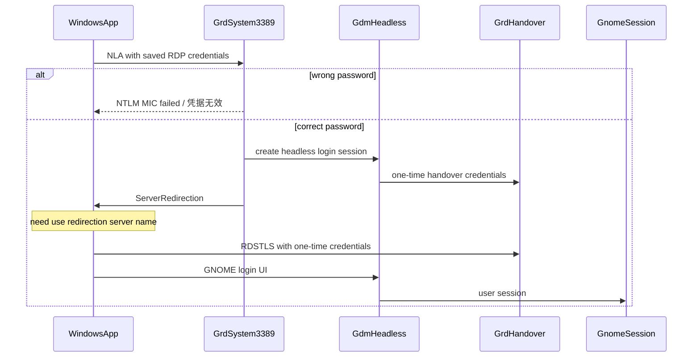

用 Mac 上的 **Windows App**（原 Microsoft Remote Desktop）连家里的 Ubuntu。

GNOME 50 已经没有 X11 的 GNOME Shell。要独立的 GNOME 桌面，走 **GNOME 远程登录**（系统服务 `gnome-remote-desktop.service`），不要再指望 xrdp 起第二套 `gnome-session`。xrdp 仍可用于 Cinnamon 等 X11 会话。

密码、证书私钥不要写进笔记。RDP 密码在服务器 `/root/<rdp-user>.pass`，用 `sudo grdctl --system status --show-credentials` 核对。SSH 别名、overlay IP 以本机 `~/.ssh/config` 为准。

## 选哪条路

|            | GNOME 远程登录（系统服务）                              | GNOME 远程桌面（镜像本机）                  | xrdp 独立会话                     |
| ---------- | ------------------------------------------------------- | ------------------------------------------- | --------------------------------- |
| 适用       | 要独立 GNOME，本机可没插显示器                          | 本机已经用同一用户登录了 GNOME              | 非 GNOME 的 X11（如 Cinnamon 2D） |
| 看到的桌面 | 无头 GNOME（虚拟显示器）                                | 本机正在用的那套（`mirror-primary`）        | 另一套 Xorg（常见 `:10`）         |
| 认证       | `grdctl --system` 的 RDP 账密，然后 GDM 再登 Linux 用户 | GNOME 里单独设的 RDP 账密，**不是**自动 PAM | Linux 登录密码（PAM）             |
| `.rdp`     | 开 NLA / CredSSP，并开重定向服务器名                    | 开 NLA / CredSSP                            | 关 NLA / CredSSP                  |
| 本机登出后 | 仍可再连                                                | 共享停止                                    | 仍可再连                          |
| 谁听 3389  | `gnome-remote-desktop-daemon --system`                  | 用户态 `gnome-remote-desktop.service`       | `xrdp`                            |

同一用户本机已经有 GNOME 时，不要再给 xrdp 起第二套 `gnome-session`。GNOME 50 会直接报 `A graphical session is already running!`，窗口管理器 1–2 秒 SIGABRT，客户端闪退。这时应镜像本机会话。

3389 只能有一个占用方。当前家用机是系统级 GNOME 远程登录；`xrdp` 服务是 disabled。

## 当前家用机（ub-home）

SSH 别名 `ub-home`。图形用户 `aaa` 给本机/SSH 用；RDP 专用用户是独立 GNOME 账号（GECOS：`Independent GNOME for RDP`）。

| 项       | 值                                            |
| -------- | --------------------------------------------- |
| 组网直连 | overlay `:3389`                               |
| 监听进程 | `gnome-remote-desktop-daemon --system`        |
| xrdp     | `disabled` / `inactive`                       |
| RDP 用户 | 专用账号（与 SSH 用户分开）                   |
| 密码文件 | `/root/<rdp-user>.pass`（root `0600`）        |
| TLS      | `/etc/gnome-remote-desktop/rdp-tls.{crt,key}` |
| GPU      | NVIDIA，开机后 HDMI/DP 可全部 `disconnected`  |

没插物理显示器 **不会**导致「凭据无效」。远程登录 Greeter 日志是 `No seat assigned, running headlessly`，虚拟会话照样起。NVIDIA `Display Active: Disabled` 只说明物理口没接。

`~/.xsession` 若仍 `exec cinnamon-session-cinnamon2d`，那是给 xrdp 用的。重新启用 xrdp 会进 Cinnamon，不是 GNOME。要 GNOME 就别开 xrdp。

## 怎么连

组网已通时，直连 overlay 上的 `<overlay-ip>:3389`，不必绕 frp。这条应走组网网卡，不经过 Clash TUN。

公网（frp）：

| 项      | 值                                                        |
| ------- | --------------------------------------------------------- |
| PC 名称 | `<vps-public-ip>:<rdp-remote-port>`                       |
| 用户名  | GNOME 远程登录 / 远程桌面里设的用户名；xrdp 用 Linux 用户 |
| 密码    | 见上表对应认证来源                                        |
| 网关    | 不填                                                      |
| 证书    | 自签，选继续 / 信任                                       |

连之前先完全断开旧会话，不要点「重连」到已经死掉的 XFCE / 黑屏会话。客户端里若缓存了旧端口，改 `.rdp` 后仍可能连错。

### `.rdp` 开关

GNOME 远程登录（系统服务，Windows App / mstsc 必开重定向）：

```
enablecredsspsupport:i:1
use redirection server name:i:1
prompt for credentials:i:0
promptcredentialonce:i:1
username:s:<rdp-user>
full address:s:<overlay-ip>:3389
```

`use redirection server name:i:1` 让客户端在 ServerRedirection 之后走 **RDSTLS + 一次性凭据**。不开这一行时，Windows 会把第一跳的用户名密码再发给 handover，服务端日志是 `Could not find user in SAM database` 或 NTLM MIC 失败，客户端弹「凭据无效」。[^suse-grd-p3]

不要写 `prompt for credentials:i:1`。Windows App 即使用户名密码已在钥匙串里，这一行也会每次弹窗。

GNOME 远程桌面（镜像本机，无二次重定向）：

```
enablecredsspsupport:i:1
```

xrdp（0.9 / 0.10 对 CredSSP / GFX 都不完整，Mac Windows App 尤其容易黑屏或秒断）：

```
enablecredsspsupport:i:0
enablegfx:i:0
enablegfxh264:i:0
```

`full address` 里的端口必须等于服务端真实监听端口。以 `ss -lntp` 为准，不要沿用旧文件里的自定义端口。

### Windows App 记住密码

密码存在 macOS 钥匙串，不在 `.rdp` 明文里。

- 连接条目：`~/Library/Containers/com.microsoft.rdc.macos/Data/Library/Application Support/com.microsoft.rdc.macos/com.microsoft.rdc.application-data.sqlite`（`ZBOOKMARKENTITY` + `ZCREDENTIALENTITY`）
- 钥匙串：`service=com.microsoft.rdc.macos`，`account=` 凭据 UUID
- `ZNILPASSWORD=0` 且 `.rdp` 里 `prompt for credentials:i:0` 才会自动填

改 sqlite 前先退出 Windows App，否则内存里的旧 RDP 字符串会写回去。

RDP/NLA 这一层可以记住。连上之后若还要在 **GNOME 登录画面**再输一次 Linux 密码，那是远程登录的第二步，客户端存不了。

## 链路

GNOME 远程登录（当前默认，组网直连）：

```
Mac Windows App
  -> <overlay-ip>:3389
  -> gnome-remote-desktop-daemon --system
  -> GDM 无头 greeter + handover 守护进程
  -> 专用用户的独立 GNOME
```



第一跳过了会看到 `Sending server redirection`，并拉起 `gdm-greeter-2`。随后还有一次从登录会话到用户会话的重定向。[^suse-grd-p3]

对照：

| 日志                                                | 含义                                 |
| --------------------------------------------------- | ------------------------------------ |
| `Message Integrity Check (MIC) verification failed` | 第一跳密码不对，或客户端没用对的 NLA |
| `Sending server redirection`                        | 第一跳已通过                         |
| handover 上 `Could not find user in SAM database`   | 客户端把旧账密发给了一次性凭据的会话 |
| `No seat assigned, running headlessly`              | 无物理显示器，远程会话正常           |

xrdp + frp：

```
Mac Windows App
  -> <vps-public-ip>:<rdp-remote-port>   入口 VPS 上的 frps
  -> 127.0.0.1:<xrdp-port>               家用主机上的 xrdp
  -> Xorg :10 + 非 GNOME 的 X11 会话
```

对照已有的 SSH 穿透：`<vps-public-ip>:<ssh-remote-port>` → 家用主机 `:22`。RDP 按同一套 frp 习惯另开一个远程端口。

相关角色：

- 家用主机：SSH 用户与 RDP 专用用户分开；系统级 grd 听 3389；本机 UFW 未开
- 入口 VPS：`<vps-public-ip>`，frps，UFW 默认 DROP

frpc 片段：

```toml
[[proxies]]
name = "home-rdp"
type = "tcp"
localIP = "127.0.0.1"
localPort = 3389
remotePort = <rdp-remote-port>
```

改完后 `systemctl restart frpc`。SSH 也走这条 frp，重启会短暂断开 `<ssh-remote-port>`。

GNOME 远程桌面（镜像本机，组网直连示例）：

```
Mac Windows App
  -> <overlay-ip>:3389
  -> gnome-remote-desktop-daemon（用户会话）
  -> 本机已有 GNOME（mirror-primary）
```

用户态服务：`systemctl --user enable --now gnome-remote-desktop.service`。`grdctl rdp enable`、关 view-only、设 TLS 证书、`grdctl rdp set-credentials`。空凭据会直接 `Credentials are not set, denying client`。

## 假连通

公网或 overlay 上 TCP「能连上」还不等于对面在说 RDP。

1. **Clash Party TUN**  
   覆盖规则里若把入口 IP 丢进国内代理组，TUN 会假连通，Windows App 报 **0x204**。  
   改成 `DIRECT`，并在 tun 里排除：

   ```yaml
   - IP-CIDR,<vps-public-ip>/32,DIRECT,no-resolve
   ```

   ```yaml
   tun:
     route-exclude-address:
       - <vps-public-ip>/32
       - <mesh-cidr>
   ```

   源文件在 Clash Party 的 override 目录（`~/Library/Application Support/mihomo-party/override/`）里你自己的覆盖 YAML。订阅重载可能把 `work/config.yaml` 盖回去，覆盖规则要留着。

2. **入口 VPS 的 UFW**  
   frps 已经在听 `<rdp-remote-port>`，但 INPUT 默认 DROP，公网 SYN 被丢。SSH 远程端口若早已放行，RDP 新端口要单独加：

   ```sh
   ufw allow <rdp-remote-port>/tcp comment 'home RDP via frp'
   ```

3. **组网 overlay 用户态 TCP**  
   开启用户态协议栈 / KCP 代理时，客户端对 **服务端并未监听** 的端口也可能 SYN-ACK，随后立刻断开。本机探测会显示「通」，服务器上 `127.0.0.1:<port>` 却是 Connection refused。以服务器本机 `ss` / 本机回环探测为准，不要用客户端 TCP 通当作 RDP 在听。

xrdp 进程还要读得了 TLS 私钥。官方做法：

```sh
sudo adduser xrdp ssl-cert
sudo systemctl restart xrdp-sesman xrdp
```

系统用户 `xrdp` 原先不在 `ssl-cert` 组时，微软客户端要的 TLS 会失败，日志里是 `Cannot read private key file /etc/xrdp/key.pem: Permission denied`。

## 桌面怎么起

### GNOME 远程登录（独立 GNOME）

系统服务，给专用用户一个无头 GNOME，不镜像 `aaa` 的本机会话。

```sh
sudo grdctl --system status --show-credentials
sudo grdctl --system rdp set-credentials
sudo systemctl enable --now gnome-remote-desktop.service
sudo systemctl disable --now xrdp xrdp-sesman
```

证书：`sudo grdctl --system rdp set-tls-cert` / `set-tls-key`。凭据在 TPM 不可用时回落到 GKeyFile（`/var/lib/gnome-remote-desktop/.../credentials.ini`）。

### xrdp 独立会话

只用于 X11 桌面。GNOME 50 不要走这条。

`~/.xsession` 示例（Cinnamon 2D，软件渲染，给 xorgxrdp）：

```sh
#!/bin/sh
unset WAYLAND_DISPLAY
unset DBUS_SESSION_BUS_ADDRESS
export XDG_SESSION_TYPE=x11
export GDK_BACKEND=x11
export LIBGL_ALWAYS_SOFTWARE=1
export DESKTOP_SESSION=cinnamon2d
exec dbus-run-session -- cinnamon-session-cinnamon2d
```

更旧的 Ubuntu（GNOME 46 仍有 X11）若坚持 xrdp + Ubuntu 会话，见历史写法：`gnome-session --session=ubuntu`，并在本机 seat 上不要挂着同一用户的 `gnome-shell`。`scale-monitor-framebuffer` 会导致纯黑，xrdp 会话里清掉：

```sh
gsettings set org.gnome.mutter experimental-features "[]"
```

GDM 关掉自动登录，否则同一用户的本机 gnome-shell 会占住会话：

```ini
# /etc/gdm3/custom.conf
AutomaticLoginEnable=false
```

### 镜像本机会话

本机已经用同一用户登录时：

- `screen-share-mode` 用 `mirror-primary`
- `view-only` 关掉，否则只能看不能操作
- 锁屏时 Mutter 会 `Session creation inhibited`，Windows App 窗口还没出来就消失。连之前确认 `loginctl show-session` 的 `LockedHint=no`，或关掉空闲自动锁屏
- 本机 GNOME 退出后共享即停

## 走过的弯路

| 现象                                        | 原因                                                               | 不要再试                                              |
| ------------------------------------------- | ------------------------------------------------------------------ | ----------------------------------------------------- |
| 凭据无效，服务端 MIC 失败                   | 第一跳密码错                                                       | 先 `sudo cat /root/<rdp-user>.pass`，不要改客户端协议 |
| 凭据无效，但有 `Sending server redirection` | Windows 没走 RDSTLS 一次性凭据                                     | 加 `use redirection server name:i:1`，不是没插显示器  |
| 每次都要输入已保存的密码                    | `.rdp` 写了 `prompt for credentials:i:1`                           | 改成 `i:0`，退出再开 Windows App                      |
| 连上是 XFCE / Cinnamon                      | `~/.xsession` 不是 GNOME                                           | 要 GNOME 用系统级远程登录，不要开 xrdp                |
| 登录成功后窗口立刻没了                      | 同一用户本机 GNOME 还在，远程 gnome-session 秒退                   | 独立会话走远程登录；已登录则改镜像本机                |
| 窗口没打开就消失                            | 锁屏 inhibit，或 NLA/凭据与服务端类型不匹配                        | 先看 3389 是 grd 系统服务、用户态还是 xrdp            |
| 桌面打开但是纯黑                            | `:0` 没显示器；或 Mutter `scale-monitor-framebuffer`；或客户端 GFX | 不要投 `:0`；清实验特性；xrdp 的 `.rdp` 关 GFX        |
| 客户端觉得端口通、服务器拒绝                | overlay 用户态 TCP 对未监听端口假 SYN-ACK                          | 在服务器本机探测                                      |
| Windows App 0x204                           | Clash TUN 假连通，或入口 VPS 没放行 RDP 远程端口                   | DIRECT + UFW，见上                                    |

`xrandr` 在没插显示器时所有 HDMI/DP 都是 `disconnected`。镜像本机这条路没有画面可抓；远程登录不依赖这些接口。

## 排障

```sh
# 服务端真实监听（不要只看客户端 TCP）
ss -lntp | grep 3389
# 当前应为 gnome-remote-desktop-daemon --system
systemctl is-active gnome-remote-desktop xrdp

sudo grdctl --system status --show-credentials
sudo journalctl -u gnome-remote-desktop.service --since '10 min ago'

# 物理口是否接了显示器（与凭据无效无关）
for c in /sys/class/drm/card*-*/status; do echo "$c $(cat $c)"; done

# xrdp（仅当改回 X11 独立会话）
sudo tail -50 /var/log/xrdp-sesman.log
sudo tail -50 /var/log/xrdp.log

# 镜像本机
journalctl --user -u gnome-remote-desktop --since '10 min ago'
loginctl show-session <id> -p LockedHint -p Type -p State
pgrep -a gnome-shell
```

- `Credentials are not set, denying client` → 没 `set-credentials`
- `Session creation inhibited` → 多半锁屏（镜像本机）
- `server supports only NLA Security` → 客户端 CredSSP 没开
- `Init TPM credentials failed` → 正常，走 GKeyFile

Clash 若再次把入口公网 IP 送进代理，`route -n get <vps-public-ip>` 会走 Clash TUN，RDP 握手超时。排除后应走物理网卡。组网直连时确认走 overlay 网卡，而不是 Clash 的假 IP。

[^suse-grd-p3]: Headless remote sessions in GNOME, Part 3

[^gnome-rdp]: GNOME Remote Desktop

[^xrdp-wiki]: xrdp wiki（证书需加入 ssl-cert）
